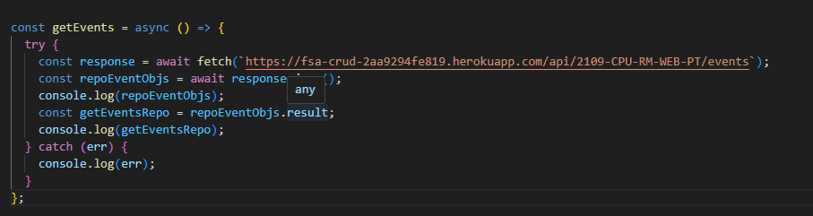
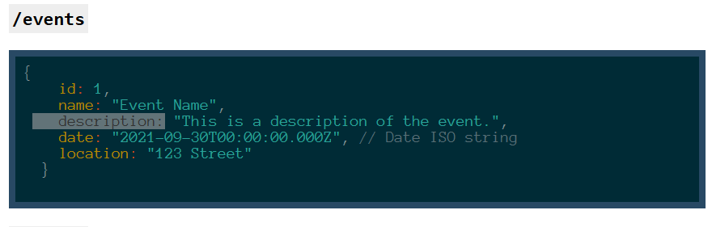
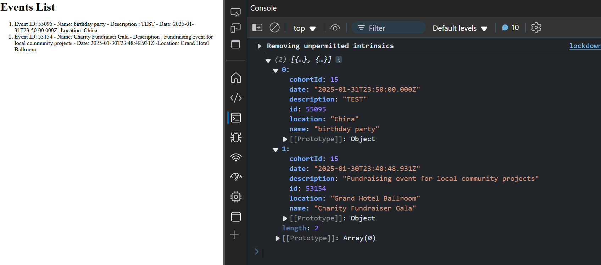
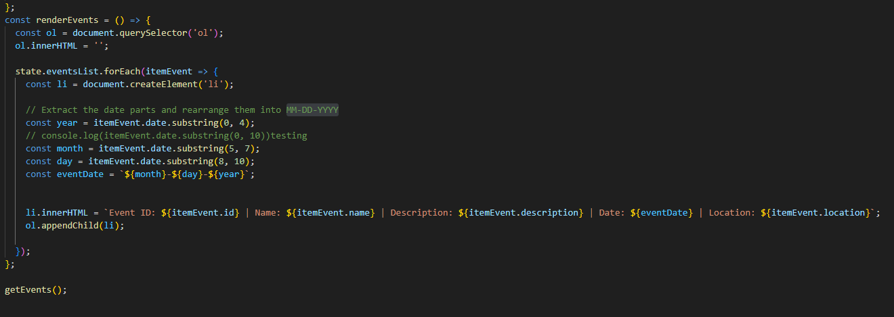

# Overview
Your friend is an event organizer and has asked you to build a website for them. They want to be able to keep track of all the parties they are organizing. They want to be able to see a list of all the parties and add new parties.

## Requirements
Build your website according to this user story:

A user enters the website and finds a list of the names, dates, times, locations, and descriptions of all the parties that are happening.

There is also a form that allows the user to enter information about a new party that they want to schedule. After filling out the form and submitting it, the user observes their party added to the list of parties.

### pseducode 
-create the states
 base on
 example like; 
 id: 1,
    name: "Event Name",
    description: "This is a description of the event.",
    date: "2021-09-30T00:00:00.000Z", // Date ISO string
    location: "123 Street"

- create a function for fecth 

- create a function for element display - Render

- Date switch to MM-DD-YYYY using subString 
